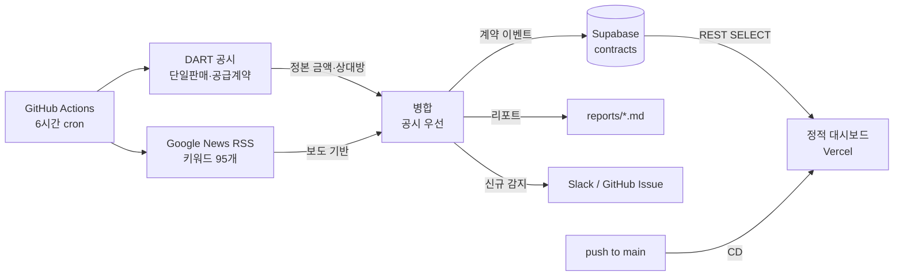
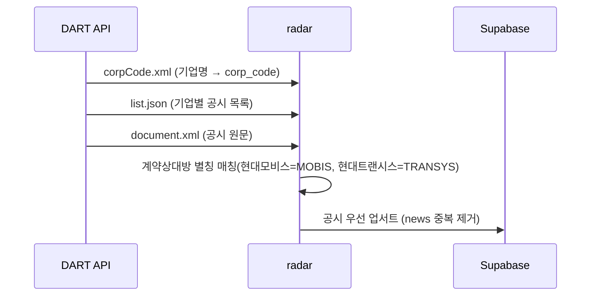

# 배터리 계약 레이더 (Battery Order Radar)

현대모비스·현대트랜시스가 발주하는 **배터리 설비·전동화 부품 계약**을 자동 수집해
경쟁사 동향으로 보여주는 대시보드입니다.

- 웹: https://test-project-two-ochre.vercel.app
- DB: Supabase Postgres (REST로 조회, 쓰기는 CI 전용 키)
- 수집: GitHub Actions 6시간 주기 + 수동 실행

---

## 이것부터 읽기

### 15 초등학생도 알게 (mode: eli15)

동네 가게에 물건을 납품하면 장부에 적히듯, 큰 회사끼리 계약을 하면 **뉴스나 공시**
라는 공개 장부에 적힙니다. 이 프로젝트는 그 장부를 로봇이 주기적으로 읽어서
"누가, 언제, 얼마짜리 계약을 땄는지" 한 화면에 모아 둔 것입니다.
사람이 매일 검색창에 키워드를 넣고 확인하는 일을 로봇이 대신합니다.

### 25 실무자 요약 (mode: eli25)

| 항목 | 내용 |
|---|---|
| 목적 | 현대모비스·현대트랜시스 배터리 설비 수주 경쟁 동향 일일 모니터링 |
| 1차 소스(**정본**) | DART Open API — 기업별 `단일판매·공급계약` 공시 원문 |
| 2차 소스(보완) | Google News RSS (미공시 계약·보도자료, 수 시간~수일 선행) |
| 저장 | Supabase Postgres `public.contracts` (event_key unique로 멱등 업서트) |
| 노출 | 정적 SPA가 Supabase REST 직접 조회 (anon 키 + RLS SELECT 전용) |
| 정본 금액 | 공시 원문의 `계약금액 총액(원)` / `확정 계약금액`(구·신 서식 모두 지원) |
| 실패 모드 | ① 공시 유보(경영상 비밀유지)로 금액 `-` ② 공시 기준 미달 계약은 뉴스에만 존재 ③ 동일 계약 복수 보도 ④ 해외법인 상대방 표기(MOBIS Czech 등) |
| 실제 관측 | 톱텍 256/211/201억 = 공시·보도 금액 일치 / 모티브링크 2,700억 = 공시 없음, 보도로만 확인 |
| 되돌리기 | `crawl_runs` 로그로 확인 후 `contracts` 행 삭제 또는 `event_key` 교체 재실행 |
| 비용 | 무료 티어 (GitHub Actions + Supabase Free + Vercel Hobby) |

---

## 구조





동일 내용 ASCII:

```
[언론 RSS] ┐
           ├─▶ [정규화/중복제거] ─▶ [Supabase contracts] ─▶ [Vercel 대시보드]
[DART 공시] ┘         │                                        ▲
                      ├─▶ reports/*.md                          │
                      └─▶ Slack / Issue 알림          [push → 자동배포]
```

---

## 파이프라인 파일

| 경로 | 역할 |
|---|---|
| `radar/config.py` | 발주처·워치리스트·키워드 사전 |
| `radar/sources/gnews.py` | Google News RSS 수집 |
| `radar/sources/dart.py` | DART Open API 수집 (정본 금액) |
| `radar/extract.py` | 금액 파싱, 공급사 식별, 중복제거 |
| `radar/db.py` | Supabase 스키마(DDL) + 업서트 |
| `radar/run.py` | 실행 CLI (수집→적재→리포트) |
| `radar/alert.py` | 신규 계약 알림 (Slack / GitHub Issue) |
| `.github/workflows/radar-crawl.yml` | 6시간 cron + 수동 실행 |
| `.github/workflows/deploy.yml` | push 시 Vercel 프로덕션 배포 |
| `public/` | 정적 대시보드 (index/app/styles/config) |

## 로컬 실행

```bash
uv venv .venv && uv pip install --python .venv/bin/python -r requirements.txt
python3 scripts/gen_config.py          # public/config.js 생성
export OPENDART_KEY=$(python3 -c "import yaml;print(yaml.safe_load(open('$HOME/API_KEYS.yaml'))['dart']['api_key'])")
.venv/bin/python -m radar.run --days 365 --when 1y

# 중복 정리(공시로 대체된 보도 행 제거)
.venv/bin/python -c "import radar.db as db; print(db.purge_superseded(14))"
```

검증:

```bash
python3 -m http.server 8137 --directory public
LD_LIBRARY_PATH=/tmp/debroot/usr/lib/x86_64-linux-gnu .venv/bin/python scripts/verify_ui.py http://127.0.0.1:8137/
LD_LIBRARY_PATH=/tmp/debroot/usr/lib/x86_64-linux-gnu .venv/bin/python scripts/shot.py http://127.0.0.1:8137/ shots/local
```

> 이 호스트에는 GPU/루트 권한이 없어 Chromium 시스템 라이브러리를
> `/tmp/debroot`에 따로 받아 `LD_LIBRARY_PATH`로 연결해 씁니다 (`apt-get download` + `dpkg-deb -x`).

## 시크릿

| 이름 | 용도 |
|---|---|
| `SUPABASE_DB_USER/PASSWORD/POOLER_HOST/PORT` / `SUPABASE_DB_NAME` | Actions에서 DB 쓰기 (IPv4 풀러 경유) |
| `SUPABASE_URL` | 프로젝트 식별용 |
| `OPENDART_KEY` | DART Open API (선택, 없으면 건너뜀) |
| `SLACK_WEBHOOK_URL` | 알림용 (선택, 없으면 GitHub Issue로 대체) |
| `VERCEL_TOKEN` / `VERCEL_ORG_ID` / `VERCEL_PROJECT_ID` | Actions에서 프로덕션 배포 |

Supabase 신규 프로젝트는 직접 DB 접속이 IPv6 전용이라 IPv4 전용 환경에서는
`aws-0-ap-northeast-2.pooler.supabase.com:6543` 풀러를 씁니다.

## 다음 단계 (미완)

- [x] `OPENDART_KEY` 적용 — 공시 정본 금액 매핑 완료 (보도 금액과 일치 검증됨)
- [ ] Google News 리다이렉트 URL 원문 복원 → 본문 정밀추출로 `미공개` 금액 보강
- [ ] 워치리스트에 없는 공급사 탐지를 위한 **전체 공시 일일 스캔** 추가
- [ ] 공급사 사전 자동 확장 (기사에서 미등록 업체명 후보 추출 → 승인 큐)
- [ ] Vercel Git 연동(대시보드 1회 클릭) 후 Actions 배포 대신 Git 트리거로 단순화

## 주의

본 자료는 뉴스·공시를 기계 수집한 결과로, 오탐/누락이 있을 수 있습니다.
투자 판단의 근거로 사용할 수 없습니다.
